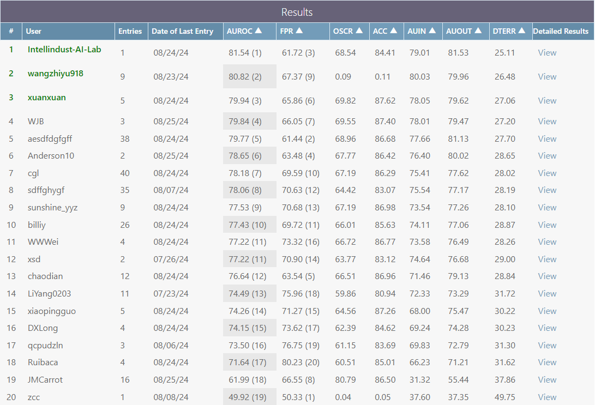
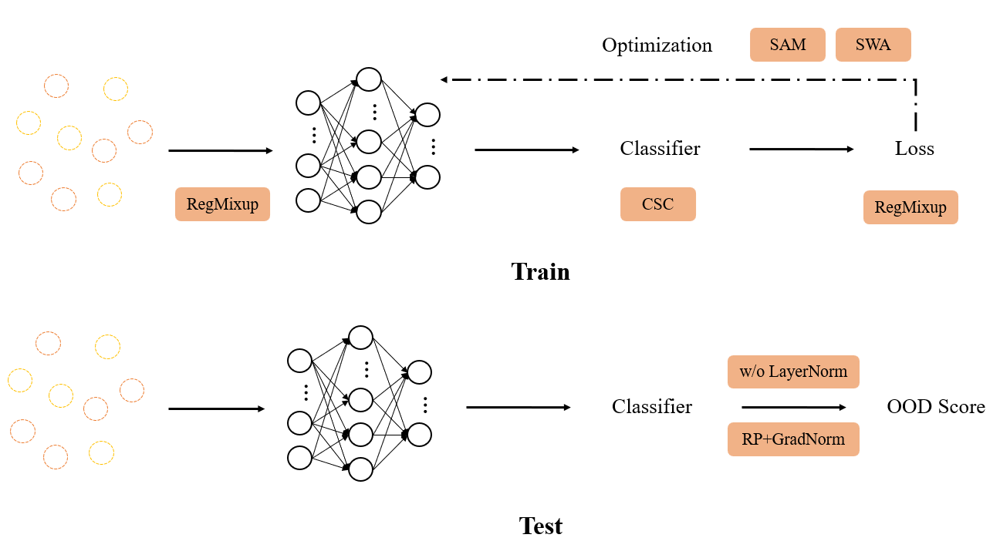
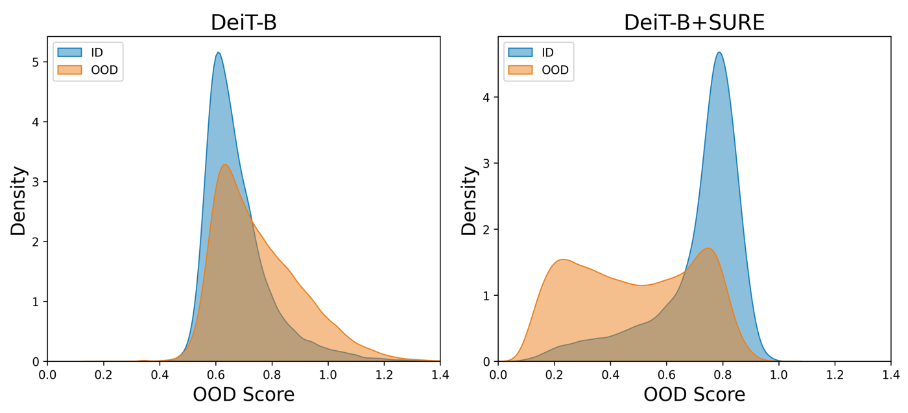

# [ECCV 2024 OOD-CV Workshop SSB Challenge (Open-Set Recognition Track)](https://www.ood-cv.org/challenge.html) - 1st Place

This repository contains the code and resources for **Intellindust-AI-Lab**, which achieved the top performance in the **ECCV 2024 OOD-CV Workshop** SSB Challenge.



## Table of Contents

1. [Overview](#Overview)
2. [Visual Results](#Visual-Results)
3. [SURE](#SURE)
4. [Installation](#Installation)
6. [Quick Start](#Quick-Start)
7. [Citation](#Citation)

## Overview 

An overview of our approach is illustrated below. You can read the detailed report here: [SURE_OOD.pdf](./docs/SURE_OOD.pdf)



## Visual Results

The visual results for open-set recognition are presented below:



## SURE 

The **SURE-OOD** method extends the existing [**SURE**](https://github.com/YutingLi0606/SURE) framework by incorporating advanced techniques for open-set recognition, achieving state-of-the-art results in the OOD-CV challenge.

For more details on the **SURE** framework, please refer to the [paper](https://openaccess.thecvf.com/content/CVPR2024/papers/Li_SURE_SUrvey_REcipes_for_building_reliable_and_robust_deep_networks_CVPR_2024_paper.pdf)


## Installation
### Environment Setup

To set up the environment, install the dependencies listed in `requirements.txt` using the following command:

```bash
pip install -r requirements.txt
```

**Note:** For testing with a resolution of 480, you will need to modify the `PatchEmbed` and `_pos_embed` functions in the `timm` library. See [Support.md](./docs/Support.md) for detailed instructions.

### Dataset Preparation

Download the **ImageNet-1k** and **ImageNet-21k** validation sets using the [**Semantic Shift Benchmark (SSB)**](https://github.com/sgvaze/SSB/blob/main/DATA.md#supported-datasets) API. Make sure to specify the correct dataset path during training.

## Quick Start
### Training

To train the model, run the following script:

```bash
bash run/run_deit_Inet1k.sh
```

This will start the training process using the pre-configured parameters and the [official pretrained model](https://dl.fbaipublicfiles.com/deit/deit_3_base_384_1k.pth). The trained model will be saved to the specified directory.

### Testing

After training, evaluate the model using the following script:

```bash
bash run/run_eval_TTA.sh
```

You can fuse the results and print them using:

```bash
python metric_result_GradNorm.py --result_dir path/to/
```

We provide a fine-tuned model: [DeiT III-Base](https://drive.google.com/file/d/1wL8q9RFs7fY8OFEcvFMEjeH4hB5wdD14/view?usp=drive_link).

## Citation
If our project is helpful for your research, please consider citing :
```
@InProceedings{Li_2024_CVPR,
    author    = {Li, Yuting and Chen, Yingyi and Yu, Xuanlong and Chen, Dexiong and Shen, Xi},
    title     = {SURE: SUrvey REcipes for building reliable and robust deep networks},
    booktitle = {Proceedings of the IEEE/CVF Conference on Computer Vision and Pattern Recognition (CVPR)},
    month     = {June},
    year      = {2024},
    pages     = {17500-17510}
}
```
